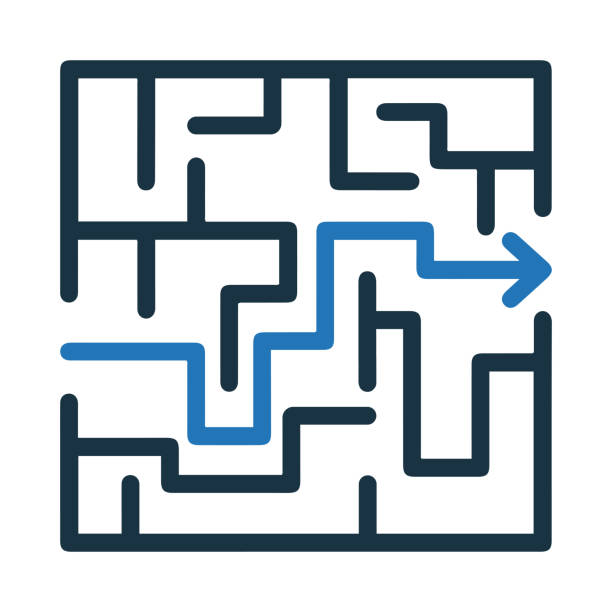
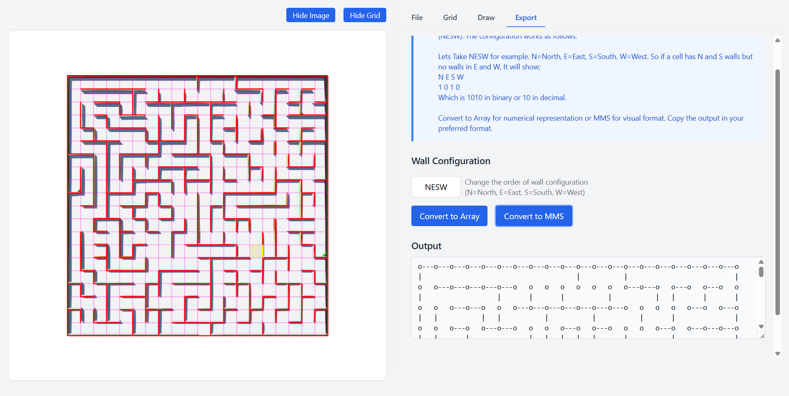

#  Image2Maze Editor

Welcome to Image2Maze! 👋 Turn your images into amazing mazes with this friendly editor. Perfect for creating mazes for micromouse simulators and more! ✨

> Transform any image into a maze with this editor. Above shows converting a Image of a maze into a maze format.

## 🚀 Download

Get the latest release from the [Releases](https://github.com/AnujaKalahara99/Image2Maze-Editor/releases) page.

## ✨ What Can You Do?

### Import Your Images

- Drop in any image as your maze template
- Watch it magically transform with an editable grid
- Show or hide the image whenever you need

### Easy Grid Editing

- Simply click cells to edit walls
- Move around with WASD or arrow keys (just like a game!)
- Toggle walls with familiar WASD controls
- See your wall setup in real-time

### Creative Draw Mode 🎨

- Draw walls quickly by clicking and dragging
- Walls sync automatically between cells (like magic!)
- Smart edge detection makes wall placement a breeze

### Flexible Export Options

- Transform your maze into arrays with custom NESW configuration
- Export directly to [MMS (Micro Mouse Simulator)](https://github.com/mackorone/mms) format for simulators
- Copy your maze as:
  - 📝 Plain text
  - 🐍 Python array
  - ⚡ C++ array

## ✅ Getting Started

### Grid Mode

1. Load an image
2. Click any cell to edit its walls
3. Use WASD or arrow keys to navigate
4. Toggle walls using WASD or the directional buttons

### Draw Mode

1. Switch to Draw tab
2. Click near cell edges to toggle walls
3. Click and drag to draw multiple walls
4. Walls automatically sync between adjacent cells

### Export Your Creation

1. Switch to Export tab
2. Configure wall order (NESW)
3. Choose export format (Array or MMS)
4. Copy the output in your preferred format (Text/Python/C++)

## Wall Configuration

Here's how walls are stored:

- North: 8 (1000)
- East: 4 (0100)
- South: 2 (0010)
- West: 1 (0001)

Don't worry about these numbers - you can easily remap them in the Export tab! 😊

## 🛠️ Built With Love Using

Made possible thanks to:

- [NeutralinoJS](https://github.com/neutralinojs/neutralinojs)
- [TailwindCSS](https://tailwindcss.com/)
- [HTML5 Canvas](https://developer.mozilla.org/en-US/docs/Web/API/Canvas_API)
